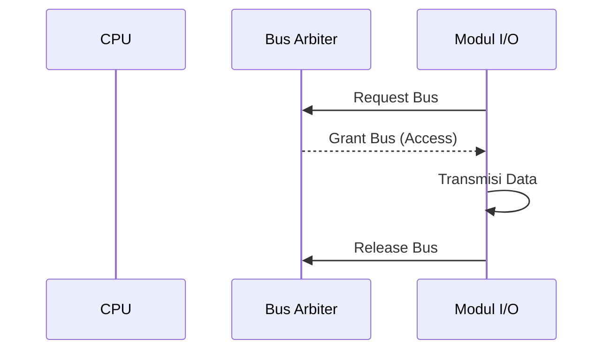

# Arbitrasi Bus Sistem

## Diagram Simulasi Arbitrasi Bus
Diagram di bawah ini menunjukkan bagaimana *Bus Arbiter* mengatur akses agar tidak terjadi tabrakan data saat modul I/O ingin mengirim data.

