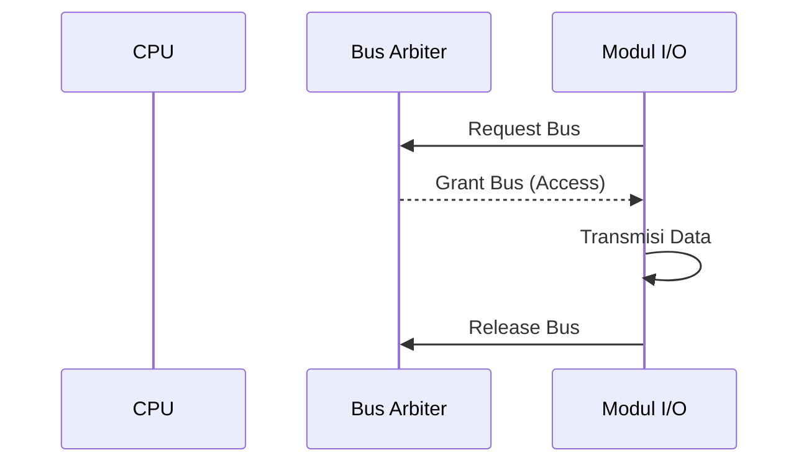

# Arbitrasi Bus Sistem

## Diagram Simulasi Arbitrasi Bus
Diagram di bawah ini menunjukkan bagaimana *Bus Arbiter* mengatur akses agar tidak terjadi tabrakan data saat modul I/O ingin mengirim data.


```markdown
## Evaluasi Materi
1. **Kerugian Metode Multiplexed:** 
   Metode ini menyebabkan rangkaian menjadi lebih kompleks dan terjadi penurunan kinerja, karena event-event tertentu yang menggunakan saluran bersama-sama tidak dapat berfungsi secara paralel.

2. **Manfaat DMA (Direct Memory Access):**
   DMA meningkatkan efisiensi karena memungkinkan modul I/O bertukar data secara langsung dengan memori tanpa harus melalui CPU, sehingga membebaskan CPU dari tanggung jawab pertukaran data tersebut.
```
