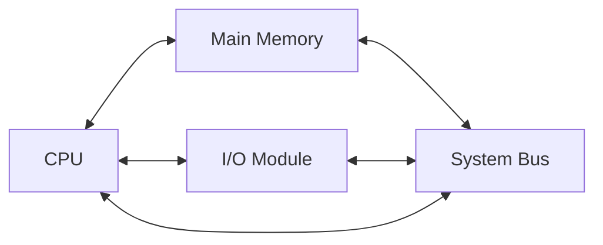

# Arsitektur Komputer - Pertemuan 1

## Struktur Dasar Komputer
Berdasarkan materi pertemuan 1 di perkuliahan saya, berikut adalah diagram struktur utama sistem komputer:

---
**Tanggal: 02 Juni 2026
Topik: Evolusi Komputer & Struktur Dasar
Insight: Mempelajari bagaimana keterbatasan fisik (seperti ukuran besar ENIAC) mendorong inovasi menuju ukuran mikro seperti pada teknologi VLSI.**
