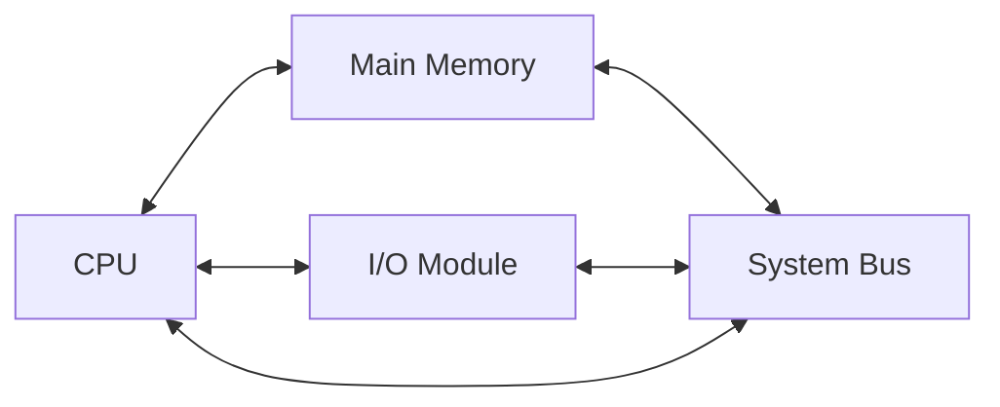

# Arsitektur Komputer - Pertemuan 1

## Struktur Dasar Komputer
Berdasarkan materi pertemuan 1 di perkuliahan saya, berikut adalah diagram struktur utama sistem komputer:

```mermaid
graph LR
    CPU[CPU] <--> Memory[Main Memory]
    CPU <--> IO[I/O Module]
    Memory <--> SystemBus[System Bus]
    IO <--> SystemBus
    CPU <--> SystemBus
```
